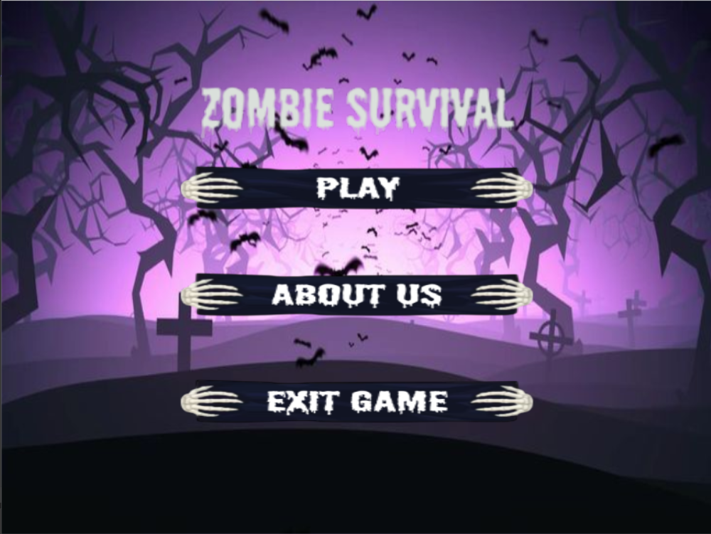

Zombie Survival is a thrilling OpenGL C++ game where players must navigate through a post-apocalyptic world overrun by zombies. Test your survival skills as you kill zombies and make strategic decisions to stay alive.

---

## Features

- **Immersive Gameplay**: Enjoy fast-paced and challenging gameplay.
- **Stunning Graphics**: Experience a visually engaging environment created with OpenGL.
- **Survival Mechanics**: Manage health, ammo, and resources to ensure your survival, "Still under constructions".
- **Dynamic Levels**: Procedurally generated levels for a unique experience every time you play.

---

## Gameplay

- **Objective**: Survive as long as possible by avoiding or defeating zombies.
- **Controls**:
  - `W`, `A`, `S`, `D`: Move your character.
  - Mouse: Aim and shoot.
  - `specialKeys`: Move Character as also `up key` for jump.

---

## Installation

### Prerequisites

- C++ Compiler (e.g., GCC or MSVC)
- OpenGL libraries (glu,glut, irrklang)

### Steps

1. Clone the repository:
   ```bash
   git clone https://github.com/Nairaalmelegy/Zombie_Survival.git
   cd Zombie_Survival
   ```
2. Build the project:
   ```bash
   mkdir build
   cd build
   cmake ..
   make
   ```
3. Run the game:
   ```bash
   ./ZombieSurvival
   ```

---

## Technologies Used

- **Programming Language**: C++
- **Graphics Library**: OpenGL
- **Frameworks**: GLUT, GLU, stb_image
- **Audio**: IrrKlang

---

## Screenshots

Add some in-game screenshots to showcase your game visually. Example:



---

## Roadmap

- [ ] Add player support.
- [ ] Implement tracking logic for zombie with different behavior patterns.
- [ ] Movement for player.
- [ ] Different level develop.

---

## Contributing

Contributions are welcome! Here’s how you can contribute:

1. Fork the repository.
2. Create a new branch for your feature:
   ```bash
   git checkout -b feature-name
   ```
3. Commit your changes:
   ```bash
   git commit -m "Add a new feature"
   ```
4. Push to the branch:
   ```bash
   git push origin feature-name
   ```
5. Open a pull request.

---

## Contact

For questions, suggestions, or feedback, please contact:

- **Developer**: Naira Mohammed, ,
- **Email**: [nairaalmelegy@gmail.com](nairaalmelegy@gmail.com)
- **GitHub**: [Nairaalmelegy](https://github.com/Nairaalmelegy)

- **Developer**: Wessal Ayman
- **Email**: [nairaalmelegy@gmail.com](#)
- **GitHub**: [Nairaalmelegy](#)

- **Developer**: Manar Daif
- **Email**: [nairaalmelegy@gmail.com](#)
- **GitHub**: [Nairaalmelegy](#)

- **Developer**: Ahmed Refat
- **Email**: [nairaalmelegy@gmail.com](#)
- **GitHub**: [Nairaalmelegy](#)

---

## Acknowledgements

- OpenGL tutorials and documentation.
- Inspiration from classic zombie survival games.
- Eng: Abdallah Mahmoud

Happy surviving! 🧟‍♂️


